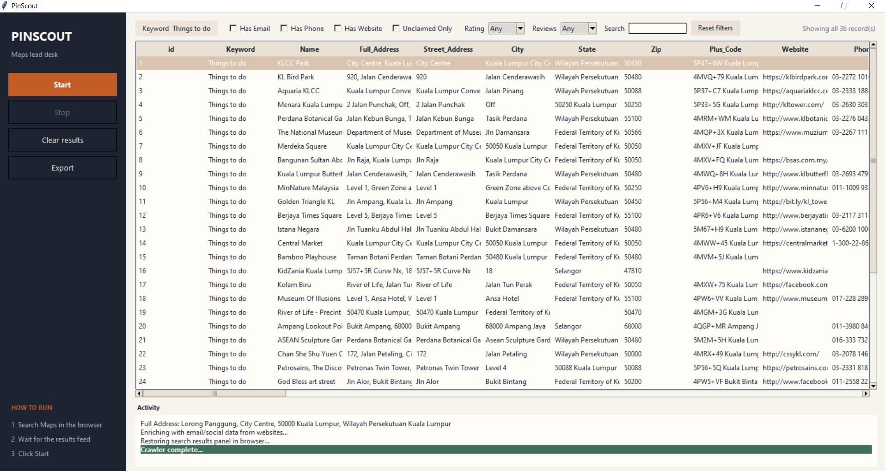
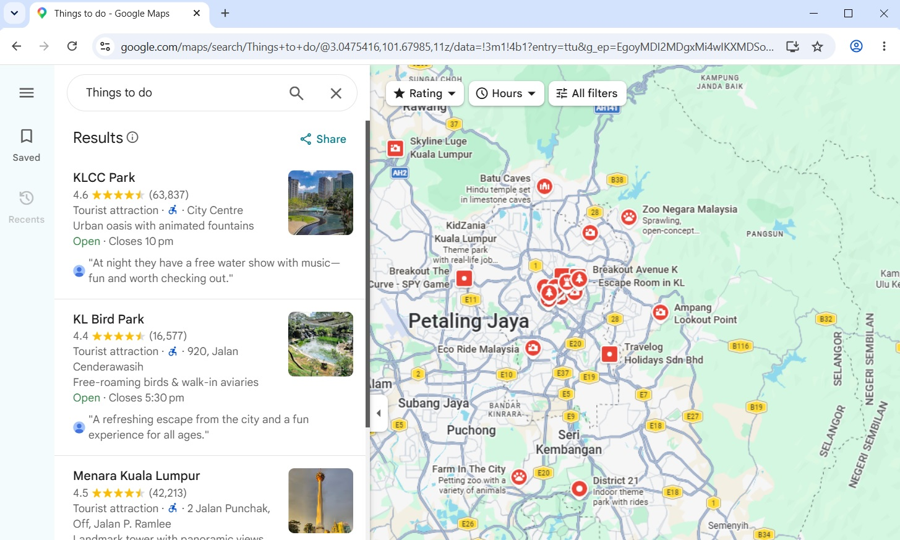

# PinScout: Google Maps Scraper and Lead Generation Dashboard

PinScout is a Python desktop application for scraping business data from Google Maps. It opens a real, visible Chromium browser for manual searching and bridges it to a Tkinter dashboard that extracts 55 data fields, enriches leads with emails and social media links from business websites, and downloads main cover photos on export.

## Disclaimer

You are responsible for complying with Google Maps Terms of Service, applicable laws, and website robots/terms when using this tool. PinScout is intended for personal and research use. Google may block or limit automated access; use at your own risk.

## Screenshots

PinScout window after a completed crawl (rail actions, filter toolbar, results table, activity log):



Google Maps browser session used for manual search:



## Features Implemented in Codebase

* Human in the Loop Browser Session (`app/browser.py`): Opens a persistent Chromium browser at `google.com/maps`. You perform searches directly in Google Maps without triggering anti bot CAPTCHAs.
* Automatic Keyword Detection (`app/scraper/keyword_reader.py`): Reads the active search keyword directly from the search box (`input#searchboxinput`), the browser URL (example `/maps/search/Museums`), or the page title.
* 55 Structured Columns (`app/models.py`): Extracts Name, Full Address, Street Address, City, State, Zip, Plus Code, Website, Phone, Email, Facebook, Twitter, Instagram, YouTube, LinkedIn, TikTok, Pinterest, Lat, Lng, Verification Text, Category, Rating, Reviews, 5 Star through 1 Star counts, Top Image URL, Sub Title, Pricing, Description, Amenities, Summary, Hours, Hours Info, Monday to Sunday, External URLs, Photo Tags, Menu URL, Services, Located In, Attributes, Google Maps URL, Saved Image Name, and Status.
* 7 Day Opening Hours (`app/scraper/listing_detail.py`): Automatically clicks the hours dropdown button (`button[aria-label*='hours']`) to expand the schedule and populate individual columns for Monday through Sunday.
* Tab Aware Extraction (`app/scraper/listing_detail.py`): Inspects the Reviews and Tickets tabs if fields are missing from Overview, extracting total review counts, star histograms, and single ticket admission prices (example `RM 130.00`).
* Text Sanitation (`app/scraper/listing_detail.py`): Strips out Private Use Area icon characters (`\ue000` to `\uf8ff`), replacement boxes (`\ufffd`), black circle icons (`✚`), and non breaking spaces (`\xa0`).
* Website Contact Enrichment (`app/enrichment/website_crawler.py`): Visits each business's official website in an async HTTP pass to extract email addresses and social links (Facebook, Twitter/X, Instagram, YouTube, LinkedIn, TikTok, Pinterest).
* Export Time Cover Photo Downloader (`app/enrichment/image_downloader.py`): Downloads the main cover photo (`Top_Image_URL`) for saved listings to `output/photos/<id>_<name>.jpg` only when you click Export.
* Smart In Memory Deduplication (`app/scraper_engine.py`): Tracks scraped place URLs in memory so clicking Start again skips already scraped listings.
* Automatic State Restoration (`app/scraper_engine.py`): Automatically navigates the browser tab back to the search results feed when scraping finishes, is stopped, or fails.
* Filter and Search Toolbar (`app/gui.py`): Interactive dashboard with:
  * Checkboxes: Has Email, Has Phone, Has Website, Unclaimed Only (`"Claim this business"`).
  * Dropdown: Min Rating (`Any`, `≥ 4.0★`, `≥ 4.5★`, `< 4.0★`).
  * Dropdown: Min Reviews (`Any`, `≥ 10`, `≥ 50`, `≥ 100`, `≥ 500`).
  * Input Box: Live Search across Name, Category, City, or Keyword.
  * Button: Reset Filters.
  * Visual Highlight: `"Crawler complete..."` highlighted with a bold green background and white text.

* Filtered Export (`app/exporter.py`): Clicking Export exports only the currently filtered subset of records to an `.xlsx` file in `output/`.
* Centralized Selectors (`app/selectors.yaml`, `app/config.py`): All DOM selectors, retry parameters, and backoff settings are stored in `app/selectors.yaml` and loaded via the `SEL` singleton.

## Requirements

* Python: `3.10` or higher
* Dependencies: `playwright`, `pandas`, `openpyxl`, `pydantic`, `pyyaml`

## Installation and Setup

### 1. Clone the Repository
```bash
git clone https://github.com/terranoss/PinScout.git
cd PinScout
```

### 2. Create and Activate Virtual Environment

**On Windows (PowerShell):**
```powershell
python -m venv venv
.\venv\Scripts\Activate.ps1
```

**On macOS / Linux:**
```bash
python3 -m venv venv
source venv/bin/activate
```

### 3. Install Dependencies
```bash
pip install -r requirements.txt
```

### 4. Install Playwright Chromium Browser
```bash
playwright install chromium
```

## How to Run and Use

### Step 1: Launch Application

**On Windows:**
```powershell
.\venv\Scripts\python.exe -m app.main
```

**On macOS / Linux:**
```bash
python -m app.main
```

### Step 2: Perform Search on Google Maps
* A visible Chromium browser window will open at `google.com/maps`.
* Type your search term directly into the Google Maps search box (example *"Museums in Kelantan"* or *"Coffee Shops in Austin"*).

### Step 3: Start
* Switch to the PinScout window.
* Click Start on the left rail.
* The scraper will scroll the results feed, collect card links, extract listing details, and run website email/social enrichment.
* Activity logs and scraped records populate live in the dashboard table.

### Step 4: Filter Records (Optional)
Use the filter toolbar above the table:
* Check Has Email to view only listings with an email.
* Check Unclaimed Only to view listings with `"Claim this business"`.
* Filter by rating or type into the Search box.

### Step 5: Export
* Click Export.
* Photos for displayed listings are saved to `output/photos/<id>_<name>.jpg`.
* The Excel file is saved to `output/gmaps_results_<timestamp>.xlsx`.

## Repository File Structure

```text
PinScout/
├── app/
│   ├── config.py                 # Loads app/selectors.yaml at import time (SEL singleton)
│   ├── selectors.yaml            # Centralized CSS selectors and retry settings
│   ├── main.py                   # Main entry point (launches Chromium & Tkinter GUI)
│   ├── gui.py                    # Scout-desk window: rail actions, filter toolbar, results table
│   ├── automation_loop.py        # Background asyncio loop for Playwright
│   ├── scraper_engine.py         # Threading bridge & scrape coordination loop
│   ├── models.py                 # Pydantic Listing model & EXPORT_COLUMN_ORDER (55 columns)
│   ├── exporter.py               # Pandas Excel/CSV exporter with dedup
│   ├── browser.py                # Playwright persistent browser context
│   ├── scraper/
│   │   ├── keyword_reader.py     # Reads active search term from input box, URL, or title
│   │   ├── results_panel.py      # Results panel card scroller (div[role='feed'])
│   │   └── listing_detail.py     # Detail pane parser, tab inspector, and text sanitizer
│   └── enrichment/
│       ├── website_crawler.py    # Async email & social media website scraper
│       └── image_downloader.py   # Async cover photo downloader triggered at export time
├── assets/                       # README screenshots
│   ├── pic1.jpg                  # PinScout window screenshot
│   └── pic2.jpg                  # Google Maps browser screenshot
├── output/                       # Output directory for exported spreadsheets
│   ├── photos/                   # Output directory for downloaded cover photos
│   ├── .gitkeep
│   └── photos/.gitkeep
├── requirements.txt              # Python package requirements
├── .gitignore                    # Git ignore rules for virtual environment and outputs
├── LICENSE                       # MIT License
└── README.md                     # Project documentation
```

## Configuration File (`app/selectors.yaml`)

DOM selectors and retry configurations are maintained in `app/selectors.yaml`:

```yaml
search:
  input_selector: "input#searchboxinput"

results_feed:
  role: "feed"
  css_fallback: "div[role='feed']"

result_card:
  css: "div[role='feed'] > div > div[jsaction]"
  name_selector: "a.hfpxzc"
  end_of_list_text: "You've reached the end of the list"

detail_pane:
  title: "h1.DUwDvf"
  category: "button.DkEaL"
  address_button: "button[data-item-id='address']"
  phone_button: "button[data-item-id^='phone:tel:']"
  website_link: "a[data-item-id='authority']"
  hours_status: "div.MkV9"
  hours_dropdown: "button[data-item-id='oh'], button[aria-label*='hours'], button[aria-label*='Hours'], button[aria-label*='Open'], button[aria-label*='Closed'], div.MkV9 button, div.MkV9"
  hours_table: "table.eK4R0e"
  star_histogram: "tr.GBkF3d"

tabs:
  reviews_tab: "button[role='tab'][aria-label*='Reviews'], button[role='tab']:has-text('Reviews')"
  tickets_tab: "button[role='tab'][aria-label*='Tickets'], button[role='tab']:has-text('Tickets')"

tickets:
  admission_container: "div[aria-label*='Admission'], div:has-text('Admission')"

retry:
  max_attempts: 3
  backoff_base_seconds: 1.5
```
